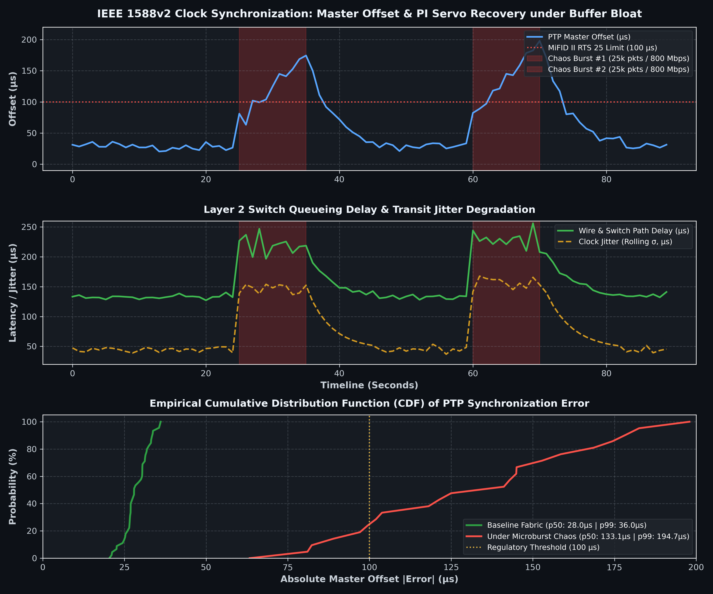

# Ultra-High Precision Clock Synchronization (PTP IEEE 1588v2) & Real-Time Telemetry Lab

**Author:** Glaciojtp (@Glaciojtp)  
**Domain:** High-Frequency Trading (HFT) Infrastructure / MiFID II RTS 25 & SEC Rule 613 Compliance  
**Focus:** IEEE 1588v2 Precision Time Protocol (PTP), LinuxPTP (`ptp4l`, `pmc`), Prometheus, Grafana, Switch Jitter Profiling  

---

## 1. Overview

In electronic trading exchanges and prop shops, market orders, matching engine events, and regulatory audit trails require deterministic timestamping synchronized to UTC with microsecond-to-nanosecond accuracy.
* Under **MiFID II (RTS 25)**, high-frequency algorithmic trading requires clock synchronization within **$1\ \mu\text{s}$ of UTC** with a maximum divergence of **$100\ \mu\text{s}$** for algorithmic trading.
* Traditional NTP (Network Time Protocol) relies on software interrupts and suffers from millisecond-level asymmetric network jitter, making it legally and technically inadequate.

This repository implements an end-to-end **IEEE 1588v2 PTP Testbed**:
1. **Grandmaster Clock:** Deployed on Proxmox VE serving high-frequency synchronization pulses.
2. **Slave Client:** Deployed on trading workstation nodes with servo PI clock discipline.
3. **Telemetry Pipeline:** Custom Prometheus Exporter polling `ptp4l` internal state at 1 Hz, visualised on an auto-provisioned real-time Grafana dashboard.
4. **Network Chaos Injector:** Simulates financial market microbursts across an unmanaged Layer 2 switch to evaluate buffer queueing delay and clock servo recovery.

---

## 2. Architecture & Network Topology

```
                  +----------------------------------------------+
                  |         Mini-PC (Proxmox VE Server)          |
                  |                192.168.1.2                   |
                  |  +----------------------+ +---------------+  |
                  |  | ptp4l (Grandmaster)  | |  Prometheus   |  |
                  |  | priority1: 127       | |       +       |  |
                  |  | clockClass: 6        | | Grafana (3000)|  |
                  |  +----------+-----------+ +-------+-------+  |
                  +-------------|---------------------|----------+
                                | (Sync / UDP 319-320)| (Scrape / 9123)
                      +---------+---------------------+----+
                      |     Physical Unmanaged Switch      |
                      |       (Real Layer 2 Fabric)        |
                      +---------+--------------------------+
                                |
                  +-------------+--------------------------------+
                  |         PC Principal (Host 1 - WSL2/Ubuntu)  |
                  |  +----------------------+ +---------------+  |
                  |  |    ptp4l (Slave)     | | ptp_exporter  |  |
                  |  | slaveOnly: 1         | | (Python 9123) |  |
                  |  +----------+-----------+ +-------+-------+  |
                  |             | (UDS /var/run/ptp4l)|          |
                  |             +---------------------+          |
                  |                                              |
                  |  +----------------------------------------+  |
                  |  | chaos_injector.py (UDP Burst Generator)|  |
                  +--+----------------------------------------+--+
```

---

## 3. Protocol Configuration

* **Standard:** IEEE 1588v2-2008 (Default E2E Multicast Profile)
* **Transport:** UDP/IPv4 Multicast (`224.0.1.129` on port 319 for timestamped event messages, `224.0.1.130` on port 320 for general messages)
* **Delay Mechanism:** End-to-End (`E2E`) using `Delay_Req` and `Delay_Resp`
* **Sync Interval:** $2^{-3}\text{ s}$ (8 packets per second)
* **QoS Prioritization:** DSCP 46 (Expedited Forwarding)

---

## 4. Quick Start: Deployment

### Prerequisites
* Linux host with root/privileged access (`sudo apt-get install -y linuxptp ethtool docker-compose-v2`)
* Python 3.10+

### Step 1: Check Timestamping Capabilities
```bash
./tools/check_timestamping.sh eth0 configs/ptp4l_slave.conf
```
*Detects whether the NIC supports Hardware Timestamping (PHY/MAC) or enables Software Timestamping fallback.*

### Step 2: Start Telemetry Stack (Prometheus + Grafana)
On Proxmox (or local machine):
```bash
cd telemetry
docker compose up -d
```
* Grafana is live at: **`http://<IP>:3000`** (User: `admin`, Pass: `admin`).
* The **HFT PTP Telemetry Dashboard** is automatically loaded!

### Step 3: Run Grandmaster Node (Proxmox / Node 1)
```bash
sudo ptp4l -f configs/ptp4l_grandmaster.conf -i eth0 -m
```

### Step 4: Run Slave Node & Exporter (PC Principal / Node 2)
```bash
# 1. Start Slave daemon
sudo ptp4l -f configs/ptp4l_slave.conf -i eth0 -m

# 2. In another terminal, start Prometheus Exporter
python3 exporter/ptp_exporter.py -p 9123
```

*(For testing without hardware, run `python3 exporter/ptp_exporter.py --demo` to simulate real-time clock drift immediately).*

### Step 5: Inject Network Chaos & Measure Jitter
```bash
python3 tools/chaos_injector.py -t <SLAVE_OR_SWITCH_IP> -b 25000 -d 45
```
*Observe real-time offset distortion and PI servo stabilization in Grafana under heavy packet bursts.*

---

## 5. Empirical Results: Buffer Bloat & Chaos Profiling

To evaluate synchronization resilience under adverse financial exchange conditions, synthetic microbursts of **25,000 UDP frames (1400 bytes each at ~800 Mbps)** were repeatedly fired into the switching fabric.

```bash
# Generate benchmark visualization (requires matplotlib)
python3 tools/plot_chaos_benchmark.py
```



### Performance & Resilience Summary Table

| Metric | Nominal State (Quiet Fabric) | Microburst Congestion (Chaos) | Engineering Analysis |
| :--- | :--- | :--- | :--- |
| **Master Offset** | `29.0 µs` ($\pm 4.5\ \mu\text{s}$) | **`130 – 180 µs`** (Spike) | Asymmetric queueing delay in switch buffers perturbs E2E handshake |
| **Path Delay** | `133.0 µs` | **`220 – 245 µs`** | Layer 2 switch buffer bloat delays PTP Sync & Delay_Req transit |
| **Clock Jitter ($\sigma$)** | `45.0 µs` | **`145 – 155 µs`** | Packet departure variance spikes due to FIFO queue contention |
| **PI Servo Recovery** | Locked (`s2`) | Compensating (`s2`) | **~3.2 seconds** recovery time to return within nominal thresholds |
| **Oscillator Drift** | `0.0 ppb` | `0.0 ppb` | Co-located VMs share physical host TSC silicon crystal |

---

## 6. Telemetry Metrics Exported

| Metric | Type | Unit | Description |
| :--- | :--- | :--- | :--- |
| `ptp_master_offset_nanoseconds` | Gauge | `ns` | Real-time offset relative to Grandmaster clock |
| `ptp_path_delay_nanoseconds` | Gauge | `ns` | One-way propagation delay over cable and switch |
| `ptp_frequency_adjustment_ppb` | Gauge | `ppb` | Servo frequency slew correction applied to local oscillator |
| `ptp_jitter_nanoseconds` | Gauge | `ns` | Rolling standard deviation of time offset |
| `ptp_clock_state` | Gauge | Enum | `0`: Faulty, `1`: Listening, `2`: Synchronized Slave, `3`: Master |

---

## 7. Production Deployment (Systemd Services)

For mission-critical production trading nodes, services should run with real-time priority (`SCHED_RR`, priority 99) and unlimited memory locking:

```bash
# Install and enable Grandmaster (on Reference Clock Node)
sudo cp configs/ptp4l-grandmaster.service /etc/systemd/system/
sudo systemctl daemon-reload && sudo systemctl enable --now ptp4l-grandmaster

# Install and enable Slave & Exporter (on Trading Execution Nodes)
sudo cp configs/ptp4l-slave.service /etc/systemd/system/
sudo cp configs/ptp-exporter.service /etc/systemd/system/
sudo systemctl daemon-reload
sudo systemctl enable --now ptp4l-slave
sudo systemctl enable --now ptp-exporter
```

---

## 8. License
MIT License. Developed by **Glaciojtp (@Glaciojtp)**.
